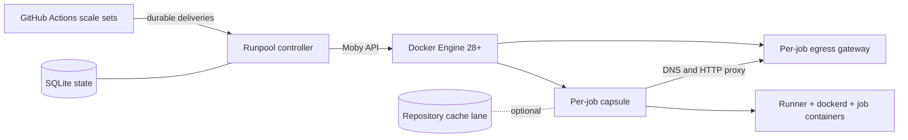

# Runpool

[](https://github.com/rhobuild/runpool/actions/workflows/ci.yml)
[](https://github.com/rhobuild/runpool/actions/workflows/codeql.yml)
[](go.mod)
[](docs/reference/support-matrix.md)
[](docs/architecture.md)
[](LICENSE)
[](https://github.com/rhobuild/runpool/releases)

Runpool is a Docker-native control plane for autoscaling ephemeral CI
runners on a single, capacity-bounded host. It translates provider demand
into durable assignments, isolated per-job execution capsules, and optional
repository-scoped cache lanes—without requiring Kubernetes.

> [!IMPORTANT]
> A version is release-qualified only after a no-skip qualification run on
> the exact platform frozen before its candidate in
> [`build/platform.lock.json`](build/platform.lock.json). Each release
> carries the record that run produced, bound to its commit and to the image
> digests it publishes; [release readiness](docs/release-readiness.md) lists
> the gates and the evidence each one leaves.

## Why Runpool

- **Clean execution:** every workload gets a fresh runner, workspace, Docker
  daemon data root, and control filesystem.
- **Bounded capacity:** runner, inner daemon, child containers, and egress
  gateway share an aggregate cgroup budget.
- **Durable delivery:** assignments are persisted before broker
  acknowledgement; redelivery is idempotent and ambiguous execution is held
  for operator review.
- **Restricted egress:** the default profile provides kernel-enforced
  no-route isolation plus a policy-enforcing DNS and HTTP relay.
- **Safe ownership:** cleanup acts only on resources carrying the expected
  instance labels; Runpool never performs daemon-wide pruning.
- **Provider-neutral lifecycle core:** delivery, attempt, lease, cache, and
  cleanup state use opaque provider keys. GitHub-specific configuration and
  metadata remain at the composition and adapter boundary; GitHub Actions is
  the only implemented provider.

## Architecture



The controller has no inbound service dependency. It maintains outbound
provider sessions, reconciles durable state with Docker, and admits work only
while scheduling and disk budgets are healthy. See the
[architecture guide](docs/architecture.md) for package boundaries, identity,
recovery, and capacity semantics.

## Security boundary

Runpool is a resource-management, environment-hygiene, and network-policy
boundary for CI workloads approved by the operator. It is **not** a hostile
code sandbox:

- the controller holds the Docker socket, which is host-root authority;
- capsules run a privileged inner Docker daemon;
- GitHub's required `--jitconfig` interface makes the one-run JIT bundle
  observable to the assigned workload, although it is kept out of controller
  persistence, Docker metadata, logs, and later capsules;
- `shared-daemon` deliberately shares the Engine's compromise domain with the
  platform and its services; `dedicated-daemon` reduces that blast radius but
  is not a VM boundary;
- public fork pull requests are outside the supported model.

Under `public-internet-only`, direct egress is denied. Proxy-aware HTTP
clients can use absolute-form requests or CONNECT to allowed addresses on
ports 80 and 443. CONNECT is an opaque tunnel; Runpool applies destination
and port policy, not application-layer inspection. `git+ssh`, direct TCP,
non-DNS UDP, IPv6, and other ports fail closed. Read the complete
[threat model](docs/security/threat-model.md) before deployment.

## Evaluate locally

Prerequisites are Go 1.26.7 and a Linux host with rootful Docker Engine 28.
The selected release-qualification target is documented in the
[support matrix](docs/reference/support-matrix.md).

```bash
git clone https://github.com/rhobuild/runpool.git
cd runpool
go build -trimpath -o runpool ./cmd/runpool
./runpool config validate --file internal/config/testdata/example.yaml
go test ./...
```

That builds the controller and checks a configuration. Reaching a job
takes three more things: the two images, a target on GitHub, and a
workflow that names the tier.

```bash
docker build -f build/capsule/Dockerfile -t runpool-capsule:dev .
docker build -f build/controller/Dockerfile -t runpool:dev .
```

`runpool-capsule:dev` is the exact name a development build looks for. A
release binary carries its capsule by digest and refuses to be pointed
elsewhere; from source, this tag is the pairing.

Then a configuration, a credential, and the state directory:

```bash
RUNPOOL_GITHUB_URL=https://github.com/<owner>/<repo> RUNPOOL_GITHUB_TOKEN_FILE=/run/secrets/runpool/token RUNPOOL_HOST_TOPOLOGY=dedicated-daemon RUNPOOL_STATE_DIR=/var/lib/runpool/state ./runpool doctor
```

`doctor` proves the host and the credential, and prints the `runs-on`
label for every tier it would serve. Then `./runpool serve`, and a
workflow in that repository:

```yaml
jobs:
  build:
    runs-on: runpool-standard
```

The [complete example workflow](deploy/workflows/example.yml) shows what
a job gets: its own Docker daemon, and egress through the relay.
[Deployment](docs/deployment.md) covers the GitHub side — which target
shapes exist, what a runner group has to grant, and which credential to
use — and the [runbook](docs/runbook.md) covers operating it.

The reference Compose deployment is version-pinned to a released digest;
the images above are how a source checkout runs.
Do not use a production credential for local experimentation.

## Deployment

Runpool provides a canonical Docker Compose manifest for its headless
controller: no domain, reverse-proxy route, or public port is required.

| Platform | Entry point |
| --- | --- |
| Docker Compose | [`deploy/compose/compose.yaml`](deploy/compose/compose.yaml) |
| A Compose platform | Deploy the canonical Compose file now; a One-Click catalog entry, where the platform has one, follows the first qualified release |

Read the [deployment guide](docs/deployment.md) before installing. The
Compose contract reads an operator-managed
[configuration file](deploy/compose/config.example.yaml); the example selects
`shared-daemon` for a host shared with a platform, and illustrates an explicit reserve for
colocated services. Measure that reserve before deployment. Choose
`dedicated-daemon` only on an exclusive CI host.

## Project documentation

| Guide | Purpose |
| --- | --- |
| [Deployment](docs/deployment.md) | Compose, platforms, credentials, and lifecycle |
| [Product contract](docs/product-contract.md) | Guarantees, exclusions, and compatibility surfaces |
| [Architecture](docs/architecture.md) | Components, dependency direction, state, and recovery |
| [Configuration](docs/reference/configuration.md) | Supported settings and validation rules |
| [CLI reference](docs/reference/cli.md) | Generated commands, flags, and exit-code behaviour |
| [Support matrix](docs/reference/support-matrix.md) | Engine compatibility, release reference, and provider scope |
| [Runbook](docs/runbook.md) | Operations, recovery, backup, GC, and uninstall |
| [Threat model](docs/security/threat-model.md) | Trust boundary, defences, one known weakness, and accepted exposure |
| [ADRs](docs/adrs/README.md) | Architectural decisions and measured constraints |
| [Release readiness](docs/release-readiness.md) | Objective gates for the first release |

## Contributing and security

Read [CONTRIBUTING.md](CONTRIBUTING.md) before opening a pull request. Report
security issues privately as described in [SECURITY.md](SECURITY.md); never
open a public issue for a suspected vulnerability.

Runpool is maintained by [Rhobuild](https://rhobuild.com) and licensed under
the [Apache License 2.0](LICENSE).
